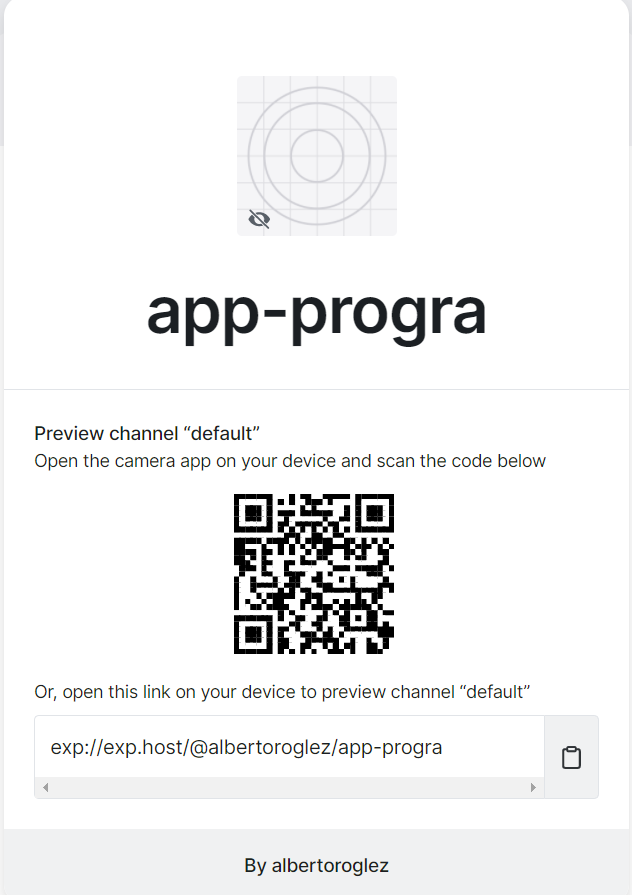

# React-Native-Escuela

No sé cómo pero la carpeta app-progra la detecta como otro repositorio de Git al subirlo aqui, de igual forma la subiré en un .rar

Lo que hicimos con el login, primero fue hacer el proyecto "app" con Android Studio usando el CLI Quickstart, y después inicializamos con Expo el proyecto "app-progra",
ahí solo copiamos y pegamos lo que ya estaba hecho en "app" y lo publicamos en mi Expo.

